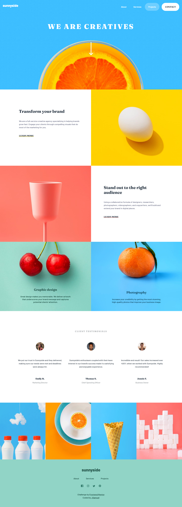

# Frontend Mentor - Sunnyside agency landing page solution ☀

This is a solution to the [Sunnyside agency landing page challenge on Frontend Mentor](https://www.frontendmentor.io/challenges/sunnyside-agency-landing-page-7yVs3B6ef). Frontend Mentor challenges help you improve your coding skills by building realistic projects.

## Table of contents 🧾

- [Overview](#overview)
  - [The challenge](#the-challenge)
  - [Screenshot](#screenshot)
  - [Links](#links)
- [My process](#my-process)
  - [Built with](#built-with)
  - [What I learned](#what-i-learned)
- [Author](#author)
- [Acknowledgments](#acknowledgments)

## Overview 👀

### The challenge 🎯

Users should be able to:

- View the optimal layout for the site depending on their device's screen size
- See hover states for all interactive elements on the page

### Screenshot 📷



### Links 🔗

- Solution URL: [Frontend Mentor](https://www.frontendmentor.io/solutions/sunnyside-agency-landing-page-_r_3tbeHfC)
- Live Site URL: [Github Pages](https://noobsammy.github.io/sunnyside)

## My process 🏗

### Built with 🧰

- Semantic HTML5 markup
- CSS custom properties
- Flexbox
- CSS Grid
- Mobile-first workflow
- JavaScript
- Git and Github
- [Normalize CSS](https://necolas.github.io/normalize.css) - For styles

### What I learned 📚

I practiced how to code a design given to me. This proyect was a little hard and slow without the sketches because I had to get sizes and colors with image editors like gimp and paint. I think the result is similar and I am satisfied with my results.

I learned some methods and events of javascript

```js
addEventListener("mouseover" , (e) => {}):
addEventListener("mouseleave" , (e) => {}):
e.target.matches("");
```

## Author ✒

- Website - [JSamuel](https://jsamuelap.github.io)
- Github - [@JSamuelAP](https://github.com/JSamuelAP)
- Frontend Mentor - [@JSamuelAP](https://www.frontendmentor.io/profile/JSamuelAP)
- LinkeIn- [@JSamuelAP](https://www.linkedin.com/in/jsamuelap)
- Twitter - [@JSamuelAP](https://www.twitter.com/JSamuelAP)
- Email - [sp4619168@gmail.com](mailto:sp4619168@gmail.com)

## Acknowledgments 💕

Before start, take a good look at the differences between mobile, desktop and active states designs, this will help you to plan the HTML structure, styles, identify where you will use flexbox or grid, where you will img tags or background-image, etc.c
If you don't have the sketches, use some image editor to get measures between elements, sizes and colors.
